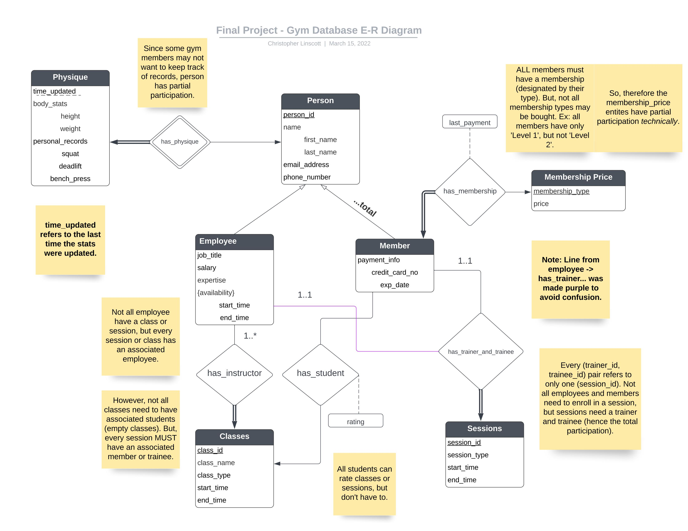

<h1 align="center">Gym Database</h1>
<h2 align="center">By Christopher Linscott</h2>

### What is it?

This is a replication of a gym database one may use in storing and representing the data
for a small-scale gym keeping track of members and employees. 

While this doesn't include all aspects (such as job scheduling, workouts, and many other features), this is a great start on what a gym database may look like.

### How can I get it started up?

First of all, git clone the repo into your current working directory, in your
favorite text editor (like VSCode, Atom, etc.)

If you haven't already, get started and set up [MySQL](https://dev.mysql.com/doc/mysql-getting-started/en/).

With mySQL set up, go into mysql (i.e. log and connect) while being in the project's directory, and initalize the tables, procedures, routines, and permissions by calling the following commands:

`source sql/setup.sql;`
`source sql/setup-routines.sql;`
`source sql/setup-passwords.sql;`
`source sql/grant-permissions.sql;`

Afterward, you can add the data in the CSV folder by the following command:

`source sql/load-data.sql`
- __IMPORTANT__: not all data will flow directly into the database, as it's randomly generated
and primary or foriegn key constraints may be broken.

> NOTE: if you want to create new data (which goes into the csv folder), you can utilize constants.py to change the number of datapoints (roughly) and run both create_col_data.py and create_row_data.py (just run the files themselves)

With this, we're ready to go!

Open `app.py` and run the file to get started and see what this application can do! :)

### How does it work? / How is it designed?

Here's an ER diagram, with many notes included alongside it:

The DDL, or way tables and relationships are designed, is made around this 
ER diagram as well as keeping everything in [BCNF Form](https://en.wikipedia.org/wiki/Boyce%E2%80%93Codd_normal_form). While this does create more tables, for a gym management database
where clients and admins will likely navigate classes and sessions, I don't want redundant information that makes it harder to come to a conclusion (i.e. make a buisness or health decision). 
In other words, if my class table has many records (which have same class_id for example) due to a redundancy caused by other records ONLY differentiating by rating, we need to break it down further
to eliminate this redundancy (for the admin and member's sake).

The gym management database was created as a starter, with lots of freedom in certain places
(like generalizing everyone to be an employee whom can train or instruct a class) and less freedom
in other areas (only 1-1 sessions for training). 

